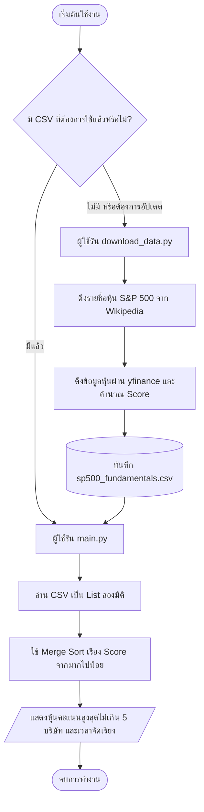
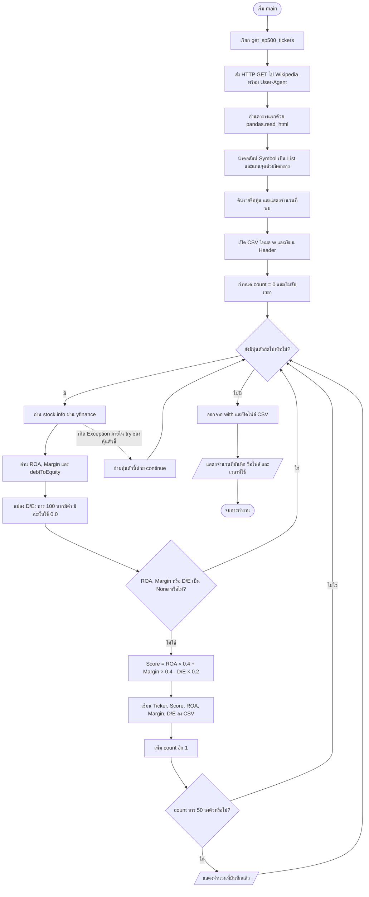
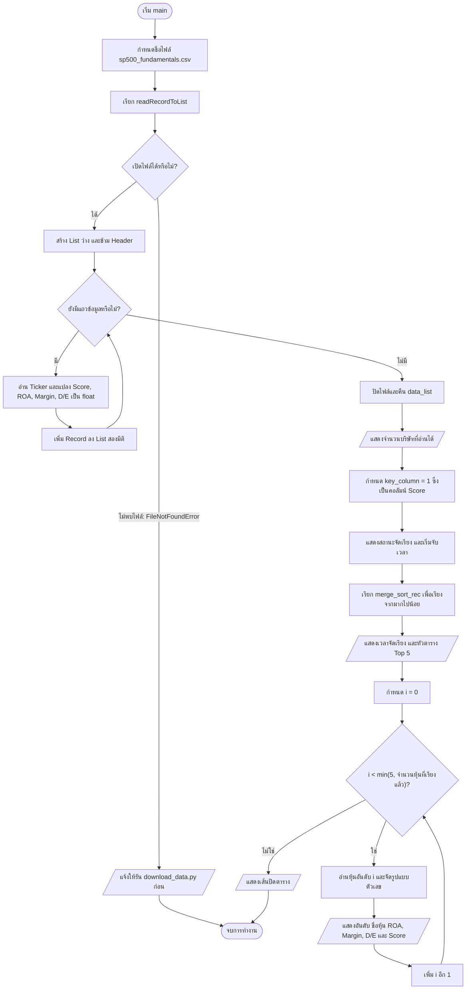
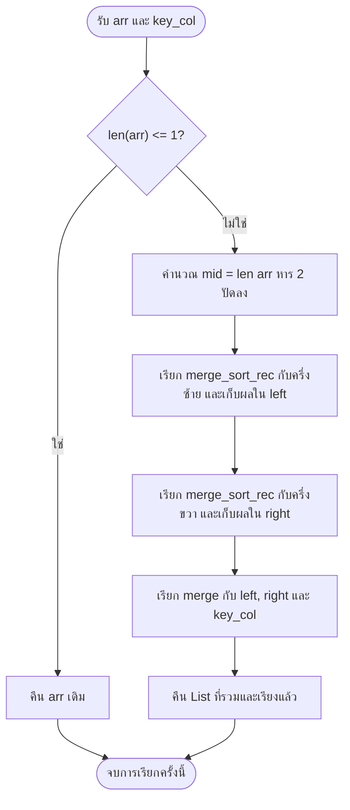
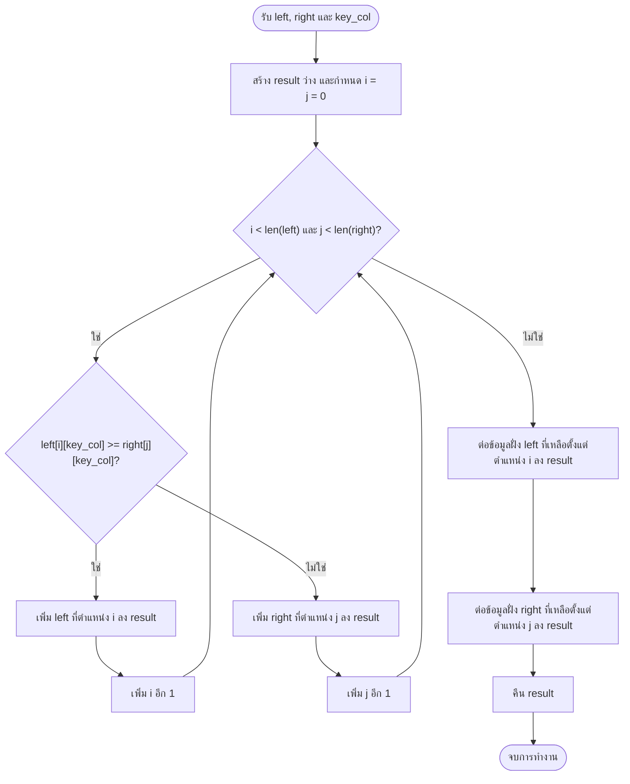

# Flowchart การทำงานของโปรเจ็กต์ S&P 500 Stock Analyzer

แผนภาพนี้อ้างอิงการทำงานจริงใน `download_data.py` และ `main.py` โดยใช้ Mermaid สามารถเปิดดูในโปรแกรมที่รองรับ Mermaid หรือคัดลอกโค้ดแผนภาพไปใช้ต่อได้

## 1. ภาพรวมของโปรเจ็กต์

แผนภาพนี้เป็นลำดับการใช้งาน: ทั้งสองสคริปต์ต้องรันแยกกัน `main.py` ไม่ได้เรียก `download_data.py` อัตโนมัติ และสามารถใช้ไฟล์ CSV ที่มีอยู่ได้ทันที

## 2. การเตรียมข้อมูล — download_data.py

- `try/except` ครอบคลุมตั้งแต่ดึงข้อมูลของหุ้นแต่ละตัวจนถึงแสดงความคืบหน้า หากเกิด Exception ในช่วงนี้จะข้ามไปหุ้นถัดไป
- หากไม่มีคีย์ ROA หรือ Margin จะใช้ `0` แต่หากมีคีย์และค่าเป็น `None` จะข้ามหุ้นนั้น ส่วน D/E ที่ไม่มีค่าจะถูกแทนด้วย `0.0`
- การดึงรายชื่อจาก Wikipedia และการเปิดไฟล์อยู่นอก `try/except` ดังกล่าว หากล้มเหลว โปรแกรมจะหยุดด้วยข้อผิดพลาด
- โหมด `w` เขียนทับไฟล์ CSV เดิมเมื่อรันสคริปต์นี้

## 3. โปรแกรมหลัก — main.py

Record แต่ละแถวมีรูปแบบ `[Ticker, Score, ROA, Margin, Debt_to_Equity]` โดยใช้คอลัมน์ index `1` เป็นกุญแจจัดเรียง ตอนแสดงผลจะคูณ ROA และ Margin ด้วย 100 เพื่อแสดงเป็นเปอร์เซ็นต์

ในโค้ดจริง การแสดงผลใช้ `for i in range(min(5, len(sorted_stocks)))` แผนภาพจึงแสดงเป็นการตรวจเงื่อนไขและเพิ่ม `i` เพื่อให้เห็นการวนซ้ำชัดเจน หากข้อมูล CSV ผิดรูปแบบหรือแปลงเป็น `float` ไม่ได้ โปรแกรมไม่ได้ดักข้อผิดพลาดนั้นไว้

## 4. การแบ่งข้อมูลแบบเรียกซ้ำ — merge_sort_rec(arr, key_col)

การเรียกซ้ำแต่ละครั้งจะใช้ขั้นตอนเดียวกัน จนเหลือ List ที่มี 0 หรือ 1 รายการ จากนั้นจึงรวมผลกลับขึ้นมาตามลำดับการเรียก

## 5. การรวมข้อมูล — merge(left, right, key_col)

เงื่อนไข `>=` ทำให้เลือกคะแนนมากกว่าก่อน จึงเรียงจากมากไปน้อย หากคะแนนเท่ากันจะเลือกฝั่งซ้ายก่อน ทำให้คงลำดับเดิมของรายการที่คะแนนเท่ากัน

สัญลักษณ์: วงรี = เริ่ม/จบ, สี่เหลี่ยม = ประมวลผล, สี่เหลี่ยมข้าวหลามตัด = เงื่อนไข, สี่เหลี่ยมด้านขนาน = แสดงผล และทรงกระบอก = ไฟล์ข้อมูล
